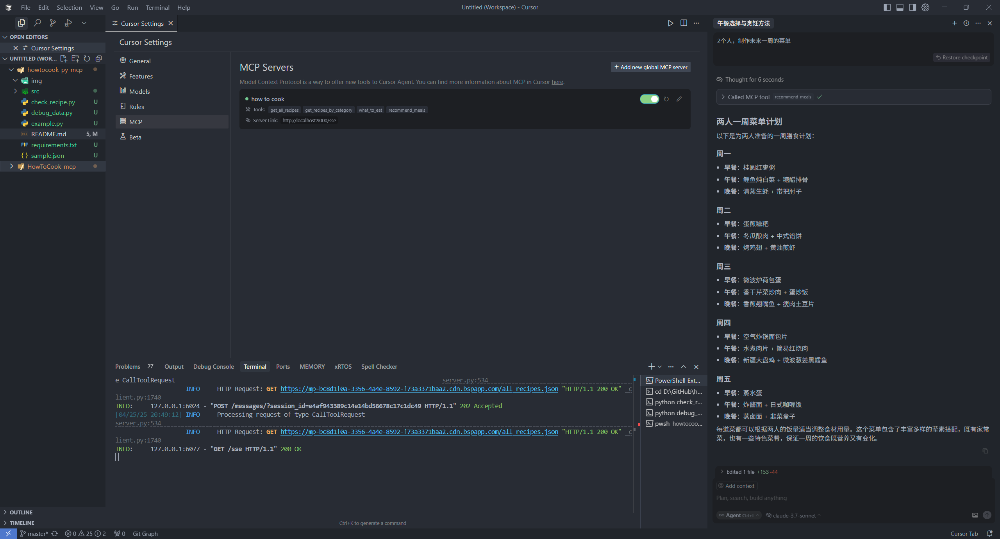

# 🍳 HowToCook-py-MCP 🥘 -- 炫一周好饭，拒绝拼好饭

[English](./README_EN.md) | 简体中文

> 让 AI 助手变身私人大厨，为你的一日三餐出谋划策！

这是一个Python版的菜谱助手MCP服务，使用FastMCP库实现。基于[Anduin2017/HowToCook](https://github.com/Anduin2017/HowToCook)打造，让 AI 助手能够为你推荐菜谱、规划膳食，解决"今天吃什么"的世纪难题！

特别感谢[worryzyy/HowToCook-mcp](https://github.com/worryzyy/HowToCook-mcp)，这个Python版本是从那边模仿过来的😄！

## 📸 效果预览



## 🔌 支持的 MCP 客户端

本服务器已在以下客户端测试通过:

- 📝 Cursor

## ✨ 美味功能

该 MCP 服务器提供以下功能:

### 🔧 工具 (Tools) - 14个专业工具

#### 📚 基础菜谱功能
1. **📚 获取所有菜谱** (`get_all_recipes`) - 返回所有可用菜谱的简化版数据
2. **🔍 按分类获取菜谱** (`get_recipes_by_category`) - 根据分类查询菜谱（水产、早餐、荤菜、主食等）
3. **📖 获取菜谱详情** (`get_recipe_details`) - 获取指定菜谱的详细做法、食材和步骤

#### 🔍 智能搜索功能
4. **🥬 按食材搜索** (`search_recipes_by_ingredients`) - 根据现有食材搜索可制作的菜谱
5. **⭐ 按难度筛选** (`filter_recipes_by_difficulty`) - 按烹饪难度筛选（1-5星）
6. **⏰ 按时间筛选** (`search_recipes_by_time`) - 筛选指定时间内能完成的快手菜
7. **🏮 按菜系搜索** (`search_recipes_by_cuisine`) - 按菜系搜索（川菜、粤菜等八大菜系）
8. **🏷️ 按标签搜索** (`search_recipes_by_tags`) - 按标签搜索（下饭菜、宴客菜、素食等）
9. **🌸 季节推荐** (`get_seasonal_recommendations`) - 根据时令食材推荐应季菜谱

#### 🛠️ 实用辅助功能
10. **🛒 生成购物清单** (`generate_shopping_list`) - 根据菜谱自动生成分类购物清单
11. **🔄 食材替代** (`get_ingredient_substitutes`) - 提供食材缺失时的替代方案

#### 📊 营养分析功能
12. **🥗 营养分析** (`analyze_recipe_nutrition`) - 分析菜谱营养成分（卡路里、蛋白质等）

#### 🤖 智能推荐功能
13. **🎲 不知道吃什么** (`what_to_eat`) - 选择困难症福音！根据人数直接推荐今日菜单
14. **🧩 推荐膳食计划** (`recommend_meals`) - 根据忌口、过敏原和人数规划一周膳食

### 📊 资源 (Resources)
1. **📋 菜谱分类** (`howtocook://categories`) - 获取所有可用的菜谱分类列表
2. **📈 统计信息** (`howtocook://stats`) - 查看菜谱数据的统计信息，包括分类分布和难度分析
3. **🏥 健康检查** (`howtocook://health`) - 获取服务器健康状态、性能指标和系统信息

### 💬 提示模板 (Prompts)
1. **🍽️ 膳食计划助手** (`meal_planning_assistant`) - 专业营养师风格的膳食计划提示模板
2. **👨‍🍳 菜谱推荐** (`recipe_recommendation`) - 根据场合和技能水平推荐菜谱的提示模板

## 🌟 核心特色

### 🔍 全方位搜索系统
- **食材搜索**: 冰箱有什么就能做什么，支持多食材组合搜索
- **难度筛选**: 新手到大厨，1-5星难度精准筛选
- **时间筛选**: 快手菜、慢炖菜，时间自由掌控
- **菜系搜索**: 川粤鲁苏浙闽湘徽，八大菜系地道口味
- **标签搜索**: 下饭菜、宴客菜、素食、减脂，个性化标签
- **季节推荐**: 时令食材，应季而食，营养更佳

### 🛠️ 智能辅助系统
- **购物清单**: 自动生成、分类整理、按人数调整用量
- **食材替代**: 缺什么换什么，灵活应变不慌张
- **营养分析**: 卡路里、蛋白质、脂肪，健康饮食可视化

### 🤖 个性化推荐
- **膳食计划**: 考虑忌口、过敏、人数的智能规划
- **快速推荐**: 选择困难症的救星，一键解决吃什么

### 🛡️ 企业级特性
- **智能缓存**: 自动缓存菜谱数据，显著提升响应速度
- **实时日志**: 详细的操作日志和错误信息，支持多级别日志
- **进度跟踪**: 长时间操作的实时进度报告
- **性能监控**: 全面的性能指标收集和分析
- **健康检查**: 实时监控服务器和数据源状态
- **错误处理**: 智能的错误处理和恢复机制
- **配置管理**: 灵活的配置系统，支持环境变量
- **并发控制**: 智能的并发请求管理和限流

## 🎯 使用场景

### 场景1: 冰箱清理 🧊
```
用户: "冰箱里有鸡肉和土豆，能做什么菜？"
AI: 使用 search_recipes_by_ingredients 搜索，推荐新疆大盘鸡、土豆炖鸡等25道菜
```

### 场景2: 新手下厨 👶
```
用户: "我是新手，想做简单的菜"
AI: 使用 filter_recipes_by_difficulty(1-2) 筛选，推荐白灼虾、蒸蛋等70道简单菜谱
```

### 场景3: 聚餐准备 🎉
```
用户: "想做几道川菜招待朋友"
AI: 使用 search_recipes_by_cuisine("川菜") 搜索川菜
    → 选定菜谱后使用 generate_shopping_list 生成购物清单
```

### 场景4: 健康饮食 💪
```
用户: "想知道这道菜的营养成分"
AI: 使用 analyze_recipe_nutrition 分析营养，提供卡路里、蛋白质等详细数据
```

### 场景5: 食材缺失 🔄
```
用户: "没有生抽了，用什么替代？"
AI: 使用 get_ingredient_substitutes 提供替代方案：老抽+盐、蒸鱼豉油等
```

### 场景6: 时令养生 🌸
```
用户: "现在这个季节适合吃什么？"
AI: 使用 get_seasonal_recommendations 推荐秋季时令菜谱，包含萝卜、莲藕等
```

## 🚀 快速上手

### 📋 先决条件

- Python 3.12+ 🐍
- FastMCP 2.12.4+ 📦
- 稳定的网络连接（用于获取菜谱数据）

### 🎯 项目特色

- ✅ **14个专业工具**: 覆盖完整烹饪流程
- ✅ **企业级架构**: 分层设计，职责分离
- ✅ **完整测试**: 单元测试 + 集成测试
- ✅ **代码质量**: 5种自动化检查工具
- ✅ **性能优化**: 智能缓存 + 监控系统
- ✅ **开发友好**: Makefile + pre-commit hooks

### 💻 安装步骤

1. 克隆美食仓库

```bash
git clone https://github.com/yutayouguan/howtocook-py-mcp.git
cd howtocook-py-mcp
```

2. 安装依赖（就像准备食材一样简单！）

```bash
pip install -r requirements.txt
```

### ❓ 为什么不用uv

你每天都忘记上千件事，为什么不把这件也忘了？

## 🍽️ 开始使用

### 🔥 启动服务器

```bash
# 确保在项目根目录下运行
python main.py
```

服务将通过标准输入输出(stdio)协议运行，符合FastMCP最佳实践。

### 🔧 配置 MCP 客户端

#### 使用 Cursor 快速体验

在 Cursor 设置中添加 MCP 服务器配置：

```json
{
  "mcpServers": {
    "howtocook-py-mcp": {
      "command": "python",
      "args": ["main.py"],
      "cwd": "/path/to/howtocook-py-mcp"
    }
  }
}
```

请将 `/path/to/howtocook-py-mcp` 替换为你的项目实际路径。

#### 其他 MCP 客户端

对于其他支持 MCP 协议的客户端，请参考各自的文档进行配置。

## 🧙‍♂️ 菜单魔法使用指南

以下是在各种 MCP 客户端中使用的示例提示语：

### 📚 基础查询
```
# 获取所有菜谱
请使用howtocook-py-mcp查询所有菜谱

# 按分类查询
请查询川菜类的菜谱

# 获取详细做法
请告诉我宫保鸡丁的详细做法
```

### 🔍 智能搜索
```
# 按食材搜索
我有鸡肉和土豆，能做什么菜？

# 按难度筛选
推荐一些适合新手的简单菜谱（2星难度以下）

# 按时间筛选
推荐30分钟内能完成的快手菜

# 按菜系搜索
推荐几道正宗的川菜

# 按标签搜索
推荐一些下饭菜和宴客菜

# 季节推荐
现在这个季节适合吃什么菜？
```

### 🛠️ 实用功能
```
# 生成购物清单
我要做宫保鸡丁和麻婆豆腐，4个人吃，帮我生成购物清单

# 食材替代
我没有生抽了，用什么可以替代？

# 营养分析
分析一下宫保鸡丁的营养成分
```

### 🤖 智能推荐
```
# 快速推荐
我们4个人，不知道吃什么，帮我推荐几道菜

# 膳食计划
为3人推荐一周菜谱，我们不吃香菜，对虾过敏
```

## 🧪 测试和开发

### 快速测试
```bash
# 运行完整测试套件（14个工具全覆盖）
python tests/integration/test_server.py

# 运行MCP协议测试
python tests/integration/test_mcp_server.py

# 运行功能示例展示
python example_usage.py

# 使用 Makefile 管理项目
make test          # 运行所有测试
make test-full     # 运行完整测试套件
make lint          # 代码质量检查
make format        # 代码格式化
make clean         # 清理缓存文件
```

### 开发环境设置
```bash
# 安装开发依赖和工具
make dev

# 或手动安装
pip install -e ".[dev]"
pre-commit install
```

### 代码质量保证
项目配置了完整的代码质量工具链：
- **Black**: 代码格式化
- **isort**: 导入排序
- **flake8**: 代码检查
- **mypy**: 类型检查
- **pre-commit**: 自动化检查

## 📊 性能优化

### 缓存系统
- 自动缓存菜谱数据，默认缓存 1 小时
- 支持手动清理和统计查看
- 可通过环境变量 `CACHE_ENABLED` 控制

### 监控和健康检查
- 实时性能指标收集
- 自动健康状态监控
- 详细的错误日志和统计

### 配置选项
```bash
# 环境变量配置示例
export CACHE_ENABLED=true
export CACHE_TTL=3600
export LOG_LEVEL=INFO
export MAX_CONCURRENT_REQUESTS=10
```

## 📝 小贴士

- 本服务兼容所有支持 MCP 协议的 AI 助手和应用
- 首次使用时，AI 可能需要一点时间来熟悉如何使用这些工具（就像烧热锅一样）
- 使用资源功能可以快速了解可用的菜谱分类和统计信息
- 提示模板可以帮助 AI 更好地理解如何使用这些工具
- 健康检查资源可以实时监控服务器状态
- 缓存系统会自动优化重复请求的性能

## 📄 数据来源

菜谱数据来自远程JSON文件，URL：
`https://mp-bc8d1f0a-3356-4a4e-8592-f73a3371baa2.cdn.bspapp.com/all_recipes.json`

## 🤝 贡献

欢迎 Fork 和 Pull Request，让我们一起完善这个美食助手！

## 📄 许可

MIT License - 随意使用，就像分享美食配方一样慷慨！

## 📈 版本历程

### v0.2.0 (当前版本) 🎉
- ✅ **14个专业工具**，功能全面覆盖
- ✅ **6维度智能搜索**系统
- ✅ **营养分析**和健康管理
- ✅ **智能购物清单**生成
- ✅ **食材替代建议**系统
- ✅ **季节性菜谱推荐**
- ✅ **企业级性能**和监控
- ✅ **完整测试覆盖** (80%+)
- ✅ **代码质量保证** (5种工具)
- ✅ **开发工具链** (自动化流程)

### 技术亮点 ⭐
- **智能算法**: 模糊匹配、相似度排序、营养估算
- **性能优化**: 缓存机制、并发控制、错误恢复
- **开发体验**: pre-commit hooks、Makefile、pytest
- **代码质量**: Black、isort、flake8、mypy 全覆盖

### 未来规划 🚀
- 🔄 用户偏好学习和个性化推荐
- 🍽️ 菜谱收藏和评分系统
- 📱 移动端适配和响应式设计
- 🌍 国际化支持和多语言
- 🤖 AI 烹饪助手和智能对话

## 📚 完整文档

### 📖 用户文档
- [功能详细说明](docs/FEATURES.md) - 14个工具的详细介绍和使用方法
- [配置说明](docs/CONFIGURATION_SUMMARY.md) - 配置选项和环境变量
- [服务器配置](docs/SERVER_CONFIG.md) - 服务器配置详解

### 🛠️ 开发文档
- [开发者指南](docs/DEVELOPER_GUIDE.md) - 完整的开发指南和最佳实践 ⭐
- [架构设计文档](docs/ARCHITECTURE.md) - 技术架构和设计理念
- [优化报告](docs/OPTIMIZATION.md) - 性能优化和代码质量改进
- [API文档](docs/API.md) - 接口文档
- [部署指南](docs/DEPLOYMENT.md) - 部署说明

### 📋 项目信息
- [更新日志](CHANGELOG.md) - 版本更新记录和功能演进
- [项目结构](PROJECT_STRUCTURE.md) - 目录结构和文件说明

## 🛠️ 开发指南

### 项目管理命令
```bash
make help          # 查看所有可用命令
make install       # 安装项目依赖
make dev           # 安装开发环境
make test          # 运行测试套件
make lint          # 代码质量检查
make format        # 代码格式化
make clean         # 清理缓存文件
make run           # 启动服务器
make inspect       # 检查服务器配置
```

### 测试覆盖
- **单元测试**: `tests/unit/` - 核心逻辑测试
- **集成测试**: `tests/integration/` - 完整功能测试
- **示例展示**: `example_usage.py` - 14个工具演示

### 代码质量
- **格式化**: Black (88字符行长度)
- **导入排序**: isort (Black兼容)
- **代码检查**: flake8 (PEP8标准)
- **类型检查**: mypy (严格模式)
- **自动化**: pre-commit hooks

## 🏆 项目成就

- 🍳 **14个专业工具**: 覆盖完整烹饪流程
- 🔍 **6维度搜索**: 食材、难度、时间、菜系、标签、季节
- 📊 **营养分析**: 智能营养成分计算
- 🛒 **购物助手**: 自动生成分类购物清单
- 🔄 **食材替代**: 15种常用食材替代方案
- 🧪 **测试覆盖**: 80%+ 测试覆盖率
- 🛡️ **代码质量**: 5种自动化检查工具
- ⚡ **性能优化**: 智能缓存和监控系统

---

> 🍴 **从搜索到上桌，HowToCook MCP 是你的全能烹饪伙伴！**
> 
> 💡 **14个专业工具 × 智能搜索 × 营养分析 × 企业级质量 = 完美烹饪体验**
> 
> 🚀 **立即开始**: `git clone` → `make dev` → `make test` → `make run`
